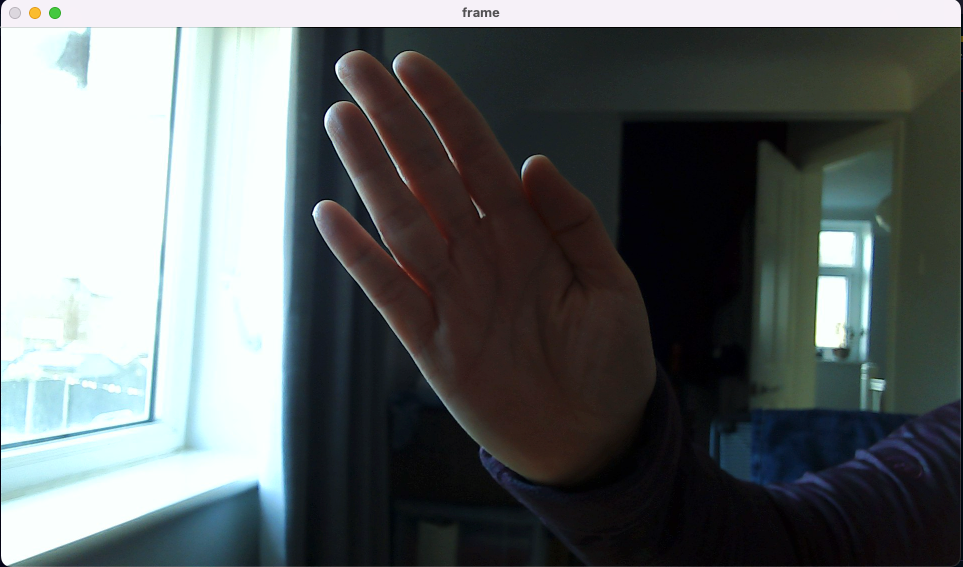

# Computer Vision RPS

This project aims to develop an implementation of a Rock-Paper-Scissors game which uses input from a webcam to play the game. 
It uses Python 3.9 and a Keras model built and trained on Teachable-Machine.

## Milestone 1

The first project milestone involved setting up the environment for the project. Git is used for version control and the repository is hosted on GitHub.

## Milestone 2

[Teachable-machine](https://teachablemachine.withgoogle.com/) was used to capture images from a webcam to form a set of training data which cover four classes: Rock, Paper, Scissors and None. The model was trained using the default hyperparameters and the Keras model was exported as an hdf5 file along with the labels.

## Milestone 3

To enable the use of Tensorflow on an M1 Mac required installing [miniforge](https://github.com/conda-forge/miniforge) rather than miniconda or full Anaconda. Acknowledgments go to [this Medium post](https://www.mrdbourke.com/setup-apple-m1-pro-and-m1-max-for-machine-learning-and-data-science/) and one of my super-helpful peers at AiCore for pointing me to it (sorry, I don't remember who!). The project uses conda to manage the specific virtual environment into which tensorflow and its dependencies are installed.

A code template was added to check that the model was functional - it captures and processes images from a computer's webcam and uses the keras model to categorise whether the image contains R/P/S/n (Rock/Paper/Scicors/none). 

The predicted probabilities for each category of whether the image contains a gesture from that class is stored in the `predictions` variable.

## Milestone 4

A python script containing code for the game's basic mechanics was added, implementing the following functions:

- `get_computer_choice`   gets a random choice of R/P/S for the computer player's choice
- `get_user_choice`   asks user to input their choice
- `get_winner`    uses if/elif/else to implement logic of deciding which player wins
- `play`  wraps calls to the previous functions to represent a game of RPS

## Milestone 5

The base code was moved to a new python file to include the functions written previously and a new function `get_prediction` to extract the user's choice as determined by the keras CV model, which could then be passed to `get_winner` to determine who won the game.

A countdown was added to enable the user to prepare for the image being captured via video. Initially, this was displayed in the terminal, and then on the video capture window to improve the user experience.

Within the `play` function, code was added to implement a 'best of five' game.

In addition to updating the code, the model was also retrained. The initial model was able to reliably predict "Rock", but performed less well for "Paper" and almost invariably classified "Scissors" as "Nothing". The model was retrained on approximately 2000 images for each category (cf. 500 for the initial model) to include different lighting conditions, and the iamges were flipped to match the orientation that was captured from the camera during the RPS game. The code was modified to apply a crop to approximately match the area captured on the Teachable Machine website and the aspect ratio. The training hyperparameters were changed to use 75 training epochs (vs. 50 for the original model). Inference was hugely improved with the updated model.

